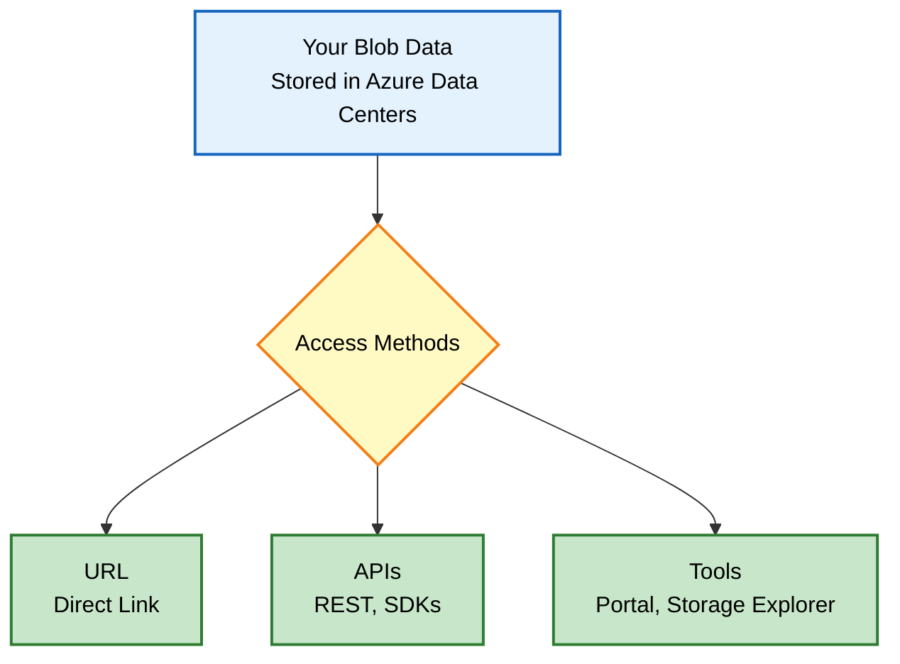
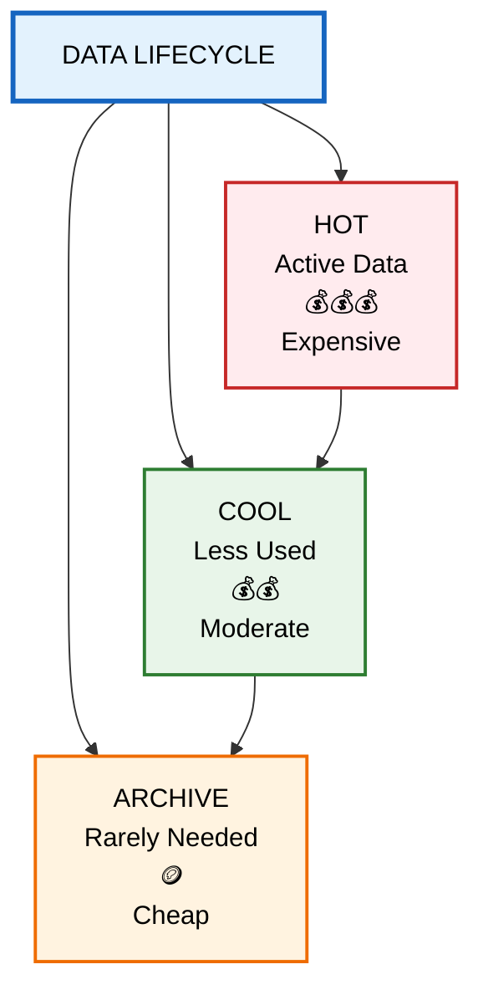
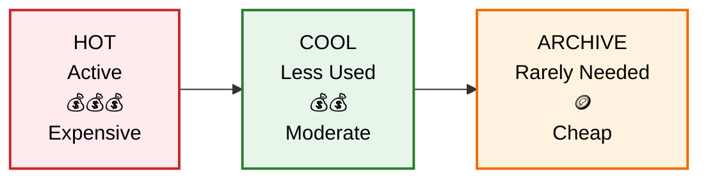
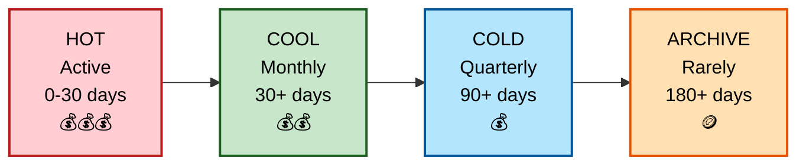
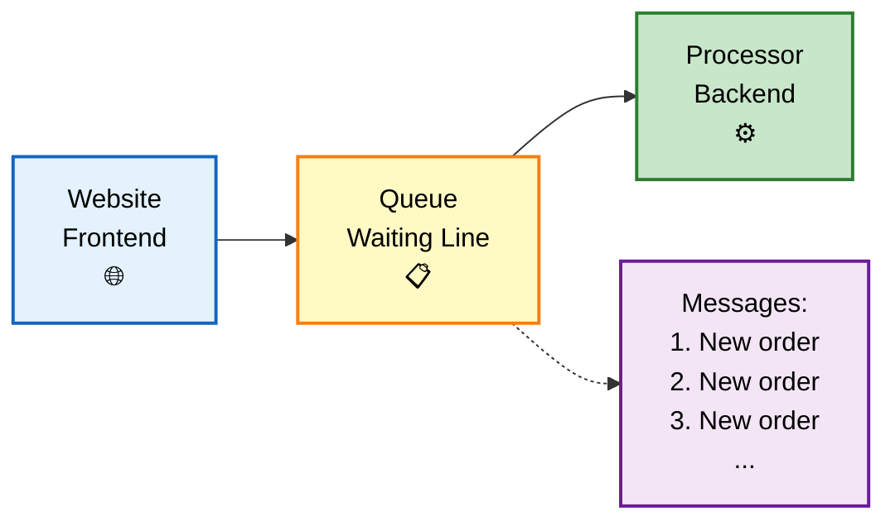
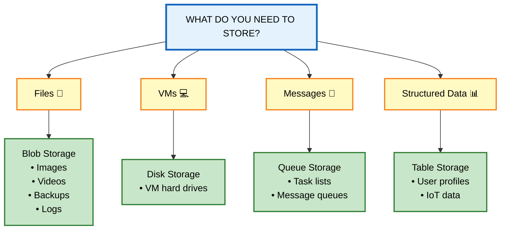

# Azure Storage Services - Simple Guide

## What is Azure Storage?

Think of **Azure Storage** as a massive digital warehouse in the cloud where you can store different types of data. Just like a real warehouse has different sections for different products (frozen food, electronics, documents), Azure Storage has different "services" for different types of data and use cases.

---

## The Five Main Storage Services

| Service | What It Is | Real-World Analogy | Best For |
|---------|-----------|-------------------|----------|
| **Azure Blobs** | Object storage for any file type | A giant digital filing cabinet | Photos, videos, backups, logs, big data |
| **Azure Files** | Managed cloud file shares | A shared network drive (like your office server) | Shared folders, replacing on-premise file servers |
| **Azure Queues** | Message storage system | A to-do list or task queue | Connecting different parts of apps, async processing |
| **Azure Disks** | Virtual hard drives | The C: drive on your computer | Azure virtual machines (VMs) |
| **Azure Tables** | NoSQL database | A simple spreadsheet that can handle millions of rows | Structured but non-relational data |

---

## Why Use Azure Storage? (The Benefits)

### 🛡️ 1. Durable & Highly Available
- **What it means:** Your data is safe even if things break
- **How it works:** Azure keeps multiple copies of your data automatically
- **Real example:** If a hard drive fails, your data is still safe on other drives
- **Bonus:** You can copy data to different cities/countries for disaster protection

### 🔒 2. Secure
- **Encryption:** All data is automatically scrambled (encrypted) when stored
- **Access control:** You decide exactly who can see what data
- **Think of it like:** A safety deposit box that only you have the key to

### 📈 3. Scalable
- **What it means:** Grows automatically as you need more space
- **Real example:** Start with 1GB, grow to 100 petabytes without changing anything
- **No worries about:** Running out of space or buying new hardware

### 🔧 4. Managed
- **What Azure handles:** Hardware maintenance, security updates, fixing broken parts
- **What you do:** Just use your data
- **Think of it like:** Renting a fully serviced apartment vs. owning a house

### 🌍 5. Accessible
- **Access from:** Anywhere with internet
- **Protocols:** HTTP/HTTPS (standard web)
- **Tools available:** 
  - Web portal (point and click)
  - Command line (PowerShell, Azure CLI)
  - Programming languages (.NET, Java, Python, Node.js, etc.)
  - REST API (for custom apps)
  - Azure Storage Explorer (desktop app)

---

## Deep Dive: Azure Blob Storage

### What is a "Blob"?
**BLOB = Binary Large Object** (fancy term for "any file")

A blob can be:
- 📸 Photos and images
- 🎬 Videos and movies
- 📄 Documents (PDFs, Word files)
- 📊 Database backups
- 📈 Log files
- 🔬 Scientific data
- 💬 Encrypted messages
- 🎮 Game assets

**Key advantage:** No restrictions on file types or sizes. Upload anything!

### Common Blob Storage Uses

| Use Case | Example |
|----------|---------|
| **Website images** | Product photos on an e-commerce site |
| **File sharing** | Distributing large files to users worldwide |
| **Streaming** | Netflix-style video delivery |
| **Backup & recovery** | Company database backups |
| **Archiving** | Old tax records you must keep but rarely access |
| **Data analysis** | Feeding data to AI/ML models |

## How to Access Blobs

**Access methods:**
- **Direct URL:** `https://myaccount.blob.core.windows.net/mycontainer/myfile.jpg`
- **REST API:** Standard web requests
- **SDKs:** Pre-built code libraries for .NET, Java, Python, Node.js, PHP, Ruby
- **Azure Portal:** Web interface (point and click)
- **Azure Storage Explorer:** Desktop application

---

## Blob Storage Tiers (Save Money Based on Usage)

Not all data is accessed equally. Azure lets you choose **storage tiers** to balance cost vs. access speed.

### The Four Tiers Explained

| Tier | Access Frequency | Min Storage | Cost | Access Speed | Use Case |
|------|-----------------|-------------|------|--------------|----------|
| **Hot** | Daily/multiple times per day | None | 💰💰💰 Highest | ⚡ Instant | Current website images, active databases |
| **Cool** | Monthly | 30 days | 💰💰 Medium | ⚡ Instant | Monthly reports, quarterly invoices |
| **Cold** | Quarterly | 90 days | 💰 Lower | ⚡ Instant | Old project files, compliance data |
| **Archive** | Rarely (yearly) | 180 days | 🪙 Lowest | 🐢 Hours (must "rehydrate") | Legal records, old backups |

### How Tiers Work

## Data Lifecycle: Moving Through Storage Tiers

As data gets older and less used, it moves to cheaper tiers:
Hot: Frequently accessed (highest cost, instant access)
Cool: Infrequently accessed (lower cost, instant access)
Archive: Rarely accessed (lowest cost, hours to retrieve)

**Alternative: Left-to-Right Flow Version**

## Data Lifecycle: Moving Through Storage Tiers

Data automatically moves from Hot → Cool → Archive as it ages, with costs decreasing at each step.

**Alternative: With Cold Tier Included**

## Data Lifecycle: Moving Through Storage Tiers

**Important Rules:**
- ✅ Hot, Cool, Cold can be set at the **account level** (applies to everything)
- ✅ **All tiers** can be set at the **individual blob level**
- ❌ Archive tier **cannot** be set at account level (only per blob)
- ⚠️ Cool/Cold have slightly lower availability guarantees (but same durability)
- ⚠️ Archive has **high retrieval costs** - only use for truly cold data

---

## Deep Dive: Azure Files

### What is Azure Files?
Managed file shares in the cloud that work exactly like your office file server, but without the hardware headaches.

### Supported Protocols

| Protocol | Works With | Best For |
|----------|-----------|----------|
| **SMB** (Server Message Block) | Windows, Linux, macOS | Windows environments, general file sharing |
| **NFS** (Network File System) | Linux, macOS | Linux environments, high-performance computing |

### Key Benefits Explained

| Benefit | What It Means | Real Example |
|---------|--------------|--------------|
| **Shared Access** | Multiple people can access same files | Marketing team editing the same brochure |
| **Fully Managed** | No server maintenance | No 3 AM calls about server crashes |
| **Scripting Support** | Automate with code | Automatically create shares for new projects |
| **Resiliency** | Always available | No downtime during power outages |
| **Familiar Code** | Use normal file commands | `copy`, `move`, `delete` work as expected |

### Azure File Sync
- **What it does:** Keeps a local copy of your cloud files on your Windows Server
- **Benefit:** Fast local access + cloud backup in one
- **Think of it like:** Dropbox or OneDrive, but for your entire server

---

## Deep Dive: Azure Queues

### What is a Queue?
A **message waiting line** for your applications.

### How It Works (Simple Example)

**The Flow:**
1. **Website (Frontend)** - Customer places an order
2. **Queue (Waiting Line)** - Order waits in line to be processed
3. **Processor (Backend)** - System picks up order and processes it

   **Key Point:** The queue acts as a buffer, ensuring the backend processor doesn't get overwhelmed during busy periods.

**Real Example - Online Pizza Order:**
1. 🍕 Customer places order on website
2. 📩 Order goes into Queue storage
3. 🔔 Azure Function triggers and processes order
4. 👨‍🍳 Kitchen receives order and starts cooking

### Queue Specifications
- **Capacity:** Virtually unlimited (millions of messages)
- **Message size:** Up to 64 KB per message
- **Access:** HTTP/HTTPS from anywhere
- **Common pairing:** Azure Functions (serverless computing)

---

## Deep Dive: Azure Disks

### What are Azure Disks?
Virtual hard drives for your Azure virtual machines (VMs).

### Comparison: Physical vs. Azure Disks

| Feature | Physical Disk | Azure Managed Disk |
|---------|--------------|-------------------|
| **Setup** | Buy, install, configure | Click button, done |
| **Maintenance** | You fix failures | Azure handles everything |
| **Availability** | Single point of failure | Automatically replicated |
| **Scaling** | Buy new hardware | Resize with restart |
| **Backup** | Manual process | Built-in snapshots |

**Think of it like:** Netflix for hard drives - stream storage capacity as needed without owning the hardware.

---

## Deep Dive: Azure Tables

### What is Table Storage?
A **NoSQL database** for storing structured data without complex relationships.

### What Makes It Different?

| Feature | Traditional SQL Database | Azure Tables |
|---------|------------------------|--------------|
| **Structure** | Rigid tables with relationships | Flexible, flat tables |
| **Scaling** | Vertical (bigger server) | Horizontal (more servers) |
| **Schema** | Fixed columns | Dynamic - each row can be different |
| **Best for** | Complex queries, transactions | Massive scale, simple data |

### Ideal Use Cases
- 🌐 Storing user profiles for millions of users
- 📊 IoT device telemetry data
- 📝 Log data from applications
- 🔍 Session state for web apps
- 📦 Metadata storage

**Key advantage:** Handles **massive amounts** of structured data cheaply and quickly.

---

## Quick Start: Which Azure Storage Service Do I Need?

---

## Summary Cheat Sheet

| If you need to... | Use this service |
|-------------------|-----------------|
| Store photos, videos, or any files | **Blob Storage** |
| Replace your office file server | **Azure Files** |
| Connect app components with messages | **Queue Storage** |
| Add storage to a virtual machine | **Disk Storage** |
| Store massive amounts of simple structured data | **Table Storage** |

---

## For better Understanding?

- [Azure Storage Documentation](https://docs.microsoft.com/azure/storage/)
- [Azure Pricing Calculator](https://azure.microsoft.com/pricing/calculator/)
- [Azure Storage Explorer Download](https://azure.microsoft.com/features/storage-explorer/)
