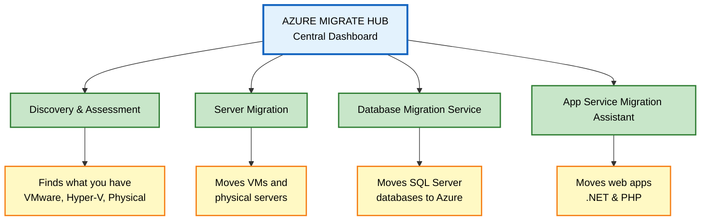
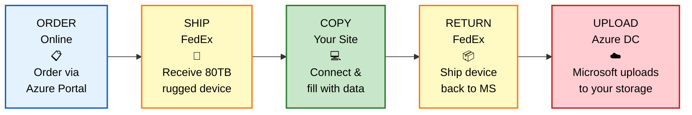
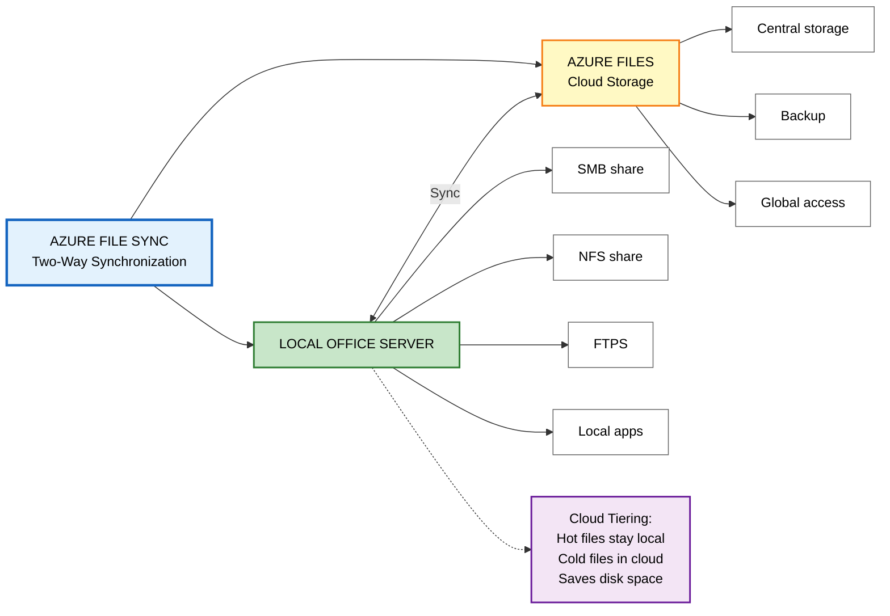
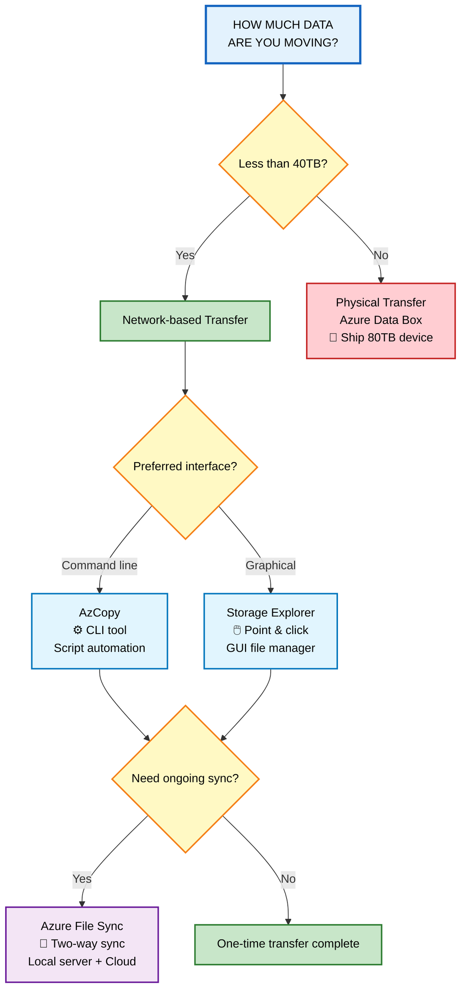

# Azure Data Migration & File Movement Guide

## Overview

Moving your data to Azure? You have options! Whether you're migrating an entire data center, shipping hard drives of data, or just copying a few files, Azure has tools for every scenario.

**Two main categories:**
- 🏗️ **Large-scale migration** - Moving entire infrastructure or massive datasets
- 📁 **File movement** - Transferring individual files or small groups

---

## Part 1: Large-Scale Migration Options

### Option A: Azure Migrate (The "Moving Company")

**What it is:** A central hub and set of tools to move your entire on-premises data center to Azure.

**Think of it like:** Hiring a professional moving company that handles everything from packing to unpacking.

#### What Azure Migrate Provides

| Feature | What It Means | Real-World Analogy |
|---------|--------------|-------------------|
| **Unified platform** | One dashboard to manage everything | A single app to track your entire move |
| **Multiple tools** | Different tools for different jobs | Packers for fragile items, movers for heavy furniture |
| **Assessment + Migration** | First evaluate, then move | Home inspection before buying, then moving in |

#### Built-in Tools in Azure Migrate



| Tool | What It Does | Use Case |
|------|-------------|----------|
| **Discovery & Assessment** | Scans your on-premises servers (VMware, Hyper-V, physical) | "What do I have and can it move to Azure?" |
| **Server Migration** | Moves VMs and physical servers to Azure | "Move my Windows/Linux servers to the cloud" |
| **Data Migration Assistant** | Checks SQL Servers for migration issues | "Will my database work in Azure?" |
| **Database Migration Service** | Moves SQL databases to Azure | "Migrate my SQL Server to Azure SQL" |
| **App Service Migration Assistant** | Moves websites to Azure App Service | "Move my .NET/PHP website to Azure" |

---

### Option B: Azure Data Box (The "Shipping Truck")

**What it is:** A physical, ruggedized hard drive shipped to you. Fill it with data, ship it back, and Microsoft uploads it to Azure.

**Think of it like:** Renting a massive moving truck when you have too much stuff to move by car.

## Azure Data Box Process



#### Data Box Specifications

| Feature | Details |
|---------|---------|
| **Capacity** | 80 TB usable storage |
| **Transfer speed** | Much faster than internet (days vs. months) |
| **Security** | Rugged case, encrypted, wiped clean after use (NIST 800-88r1 standard) |
| **Tracking** | End-to-end tracking in Azure portal |

#### When to Use Data Box

**✅ Good for:**
- 🏢 **One-time big moves** - Moving your entire data center to Azure
- 🎬 **Media libraries** - Converting offline tape archives to online streaming
- 🖥️ **VM migration** - Moving virtual machines, SQL servers, applications
- 📊 **Big data analysis** - Historical data for HDInsight/AI processing
- 🌱 **Seed + sync** - Initial bulk load, then incremental network sync
- 📅 **Regular uploads** - Monthly/quarterly bulk data transfers

**📤 Export scenarios (getting data OUT of Azure):**
- 🚨 **Disaster recovery** - Restore Azure backup to on-premises
- 🔒 **Security requirements** - Government compliance needing local copies
- 🏃 **Cloud exit** - Moving back on-premises or to another cloud provider

> 💡 **Rule of thumb:** Use Data Box when transferring **more than 40 TB** or when your internet connection is too slow/unreliable.

---

## Part 2: File Movement Options (Smaller Scale)

### Tool A: AzCopy (The "Command-Line Courier")

**What it is:** A command-line program to copy files to/from Azure storage.

**Think of it like:** A fast, scriptable courier service for your files.

#### What AzCopy Can Do

## AzCopy Commands Reference

**Alternative: Code Block Version** 

```markdown
## AzCopy Commands Reference

### Quick Command Reference

```bash
# UPLOAD: Local files to Azure
azcopy copy "C:\local\*" "https://mystorage.blob.core.windows.net/container"

# DOWNLOAD: Azure to local files
azcopy copy "https://mystorage.blob.core.windows.net/container" "C:\local\"

# COPY BETWEEN ACCOUNTS: Azure to Azure
azcopy copy "https://account1.blob.core.windows.net/container" "https://account2.blob.core.windows.net/container"

# SYNC: One-way synchronization (source → destination)
azcopy sync "C:\local" "https://mystorage.blob.core.windows.net/container"
```

**Alternative: Simple Table Version** (most accessible)

```markdown
## AzCopy Commands Reference

| Action | Command Syntax | Description |
|--------|---------------|-------------|
| **⬆️ Upload** | `azcopy copy "C:\local\*" "https://..."` | Copy local files to Azure Blob/File storage |
| **⬇️ Download** | `azcopy copy "https://..." "C:\local\"` | Copy from Azure to local machine |
| **↔️ Copy Between** | `azcopy copy "https://account1..." "https://account2..."` | Transfer between Azure storage accounts |
| **🔄 Sync** | `azcopy sync "C:\local" "https://..."` | One-way sync: adds/updates/deletes to match source |

**Key Points:**
- Use `copy` for one-time transfers
- Use `sync` for ongoing synchronization (⚠️ one-direction only!)
- Supports wildcards (`*`) for batch operations
- Works with Blob, File, and ADLS Gen2 storage
```

| Capability | Description | Example |
|-----------|-------------|---------|
| **Upload** | Local → Azure | Back up nightly logs to blob storage |
| **Download** | Azure → Local | Retrieve archived files |
| **Copy between accounts** | Azure → Azure | Move data from test to production |
| **Sync** | One-way synchronization | Keep local folder matching cloud |
| **Cross-cloud** | AWS/Google → Azure | Multi-cloud data movement |

> ⚠️ **Important:** AzCopy sync is **one-direction only** (source → destination). It's not bidirectional like Dropbox!

---

### Tool B: Azure Storage Explorer (The "File Manager")

**What it is:** A free desktop app (Windows, Mac, Linux) with a graphical interface for managing Azure storage files.

**Think of it like:** Windows File Explorer or Finder, but for Azure cloud storage.

## Azure Storage Explorer Interface

**Interface Layout:**
- **Left Panel:** Account Navigator - Browse all your storage accounts and services
- **Right Panel:** File Browser - View and manage files with action buttons

**Key Features:**
| Feature | What You Can Do |
|---------|-----------------|
| **Upload** | Drag & drop files to Azure |
| **Download** | Save Azure files to your computer |
| **Delete** | Remove files from storage |
| **New Folder** | Create virtual folders in containers |
| **Copy URL** | Get direct link to share files |

```mermaid
flowchart TD
    A[AZURE STORAGE EXPLORER<br/>Desktop App] --> B[Left Panel:<br/>Account Navigator]
    A --> C[Right Panel:<br/>File Browser]
    
    B --> B1[▶ Storage Accounts]
    B --> B2[▶ Blob Containers]
    B --> B3[▶ File Shares]
    B --> B4[▶ Queues]
    B --> B5[▶ Tables]
    
    C --> C1[📁 Container Contents]
    C --> C2[📄 Files & Folders]
    C --> C3[Action Buttons:<br/>Upload \| Download \| Delete<br/>New Folder \| Copy URL]
    
    style A fill:#e3f2fd,stroke:#1565c0,stroke-width:3px,color:#000
    style B fill:#fff9c4,stroke:#f57f17,stroke-width:2px,color:#000
    style C fill:#c8e6c9,stroke:#2e7d32,stroke-width:2px,color:#000
    style B1 fill:#ffffff,stroke:#666,stroke-width:1px,color:#000
    style B2 fill:#ffffff,stroke:#666,stroke-width:1px,color:#000
    style B3 fill:#ffffff,stroke:#666,stroke-width:1px,color:#000
    style B4 fill:#ffffff,stroke:#666,stroke-width:1px,color:#000
    style B5 fill:#ffffff,stroke:#666,stroke-width:1px,color:#000
    style C1 fill:#ffffff,stroke:#666,stroke-width:1px,color:#000
    style C2 fill:#ffffff,stroke:#666,stroke-width:1px,color:#000
    style C3 fill:#f3e5f5,stroke:#6a1b9a,stroke-width:2px,color:#000
```

How It Works:
Connect your Azure account in the left panel
Browse containers and files like Windows Explorer
Manage files with buttons or right-click menu
Transfer using AzCopy on the backend (fast & reliable)

| Feature | What You Can Do |
|---------|----------------|
| **Upload/Download** | Drag and drop files |
| **Manage blobs** | Create containers, delete files, copy URLs |
| **Multiple accounts** | Connect to multiple storage accounts at once |
| **Cross-platform** | Works on Windows, macOS, Linux |
| **Powered by** | Uses AzCopy on the backend for transfers |

**Best for:** 
- Visual file management
- Occasional transfers
- Users who prefer GUI over command line

---

### Tool C: Azure File Sync (The "Hybrid Bridge")

**What it is:** Keeps your on-premises Windows file server in sync with Azure Files automatically.

**Think of it like:** Dropbox or OneDrive, but for your entire Windows server - turning it into a mini content delivery network.

## Azure File Sync Architecture


## Azure File Sync Architecture

| Component | Location | Purpose | Features |
|-----------|----------|---------|----------|
| **Local Server** | Your office | Windows Server with File Sync agent | • SMB/NFS/FTPS shares<br>• Local app compatibility<br>• Fast access to hot files |
| **Azure Files** | Cloud | Central cloud storage | • Backup & disaster recovery<br>• Global access from anywhere<br>• Sync source for multiple sites |
| **Sync Engine** | Between both | Keeps files identical | • Two-way synchronization<br>• Automatic conflict resolution<br>• Bandwidth optimization |

**Special Feature: Cloud Tiering**

#### Key Benefits

| Feature | What It Means | Benefit |
|---------|--------------|---------|
| **Use any protocol** | SMB, NFS, FTPS on your local server | No changes to how users access files |
| **Multiple caches** | Sync many servers worldwide | Fast local access in every office |
| **Disaster recovery** | Replace failed server, reinstall sync | Back online in hours, not days |
| **Cloud tiering** | Frequently used files stay local, rarely used go to cloud | Save local disk space |

**Best for:**
- Organizations with multiple offices
- Need local file server performance with cloud backup
- Gradual migration to cloud (hybrid approach)

---

## Decision Guide: Which Migration Tool to Use?


## Decision Guide: Which Migration Tool to Use?

### Question 1: How much data are you moving?

**A) Less than 40TB with reliable internet**
- → Use **AzCopy** if you need automation and scripting
- → Use **Storage Explorer** if you prefer a visual interface

**B) More than 40TB, or unreliable/slow internet**
- → Use **Azure Data Box** (physical device shipped to you)

### Question 2: Do you need ongoing synchronization?

**Yes, keep local server and cloud in sync continuously**
- → Use **Azure File Sync** (works with both A and B above)

### Quick Reference Table

| If you... | Then use... | Example |
|-----------|-------------|---------|
| Need to script nightly backups | **AzCopy** | `azcopy sync` in a scheduled task |
| Want to drag-and-drop files | **Storage Explorer** | Browsing and uploading photos |
| Are moving 50TB of video files | **Azure Data Box** | Media library migration |
| Want local file server + cloud backup | **Azure File Sync** | Branch office server setup |


| Scenario | Recommended Tool | Why |
|----------|-----------------|-----|
| Moving entire data center | **Azure Migrate** | Comprehensive assessment + migration tools |
| Shipping 50 TB of video files | **Azure Data Box** | Faster and cheaper than uploading |
| Daily backup scripts | **AzCopy** | Automate with command line |
| Browsing and managing files visually | **Storage Explorer** | Easy GUI for all storage accounts |
| Keep branch office file server synced | **Azure File Sync** | Two-way sync with cloud tiering |
| One-time VM migration | **Azure Migrate: Server Migration** | Handles VM conversion automatically |

---

## Quick Comparison Table

| Tool | Type | Direction | Best For | Skill Level |
|------|------|-----------|----------|-------------|
| **Azure Migrate** | Service hub | To Azure only | Full infrastructure migration | IT Admin |
| **Azure Data Box** | Physical device | Both ways | >40TB, slow internet | IT Admin |
| **AzCopy** | Command-line | Both ways | Scripted/automated transfers | Developer/IT Pro |
| **Storage Explorer** | Desktop app | Both ways | Interactive file management | End User |
| **Azure File Sync** | Windows service | Both ways | Hybrid cloud/on-prem storage | IT Admin |

---

## Next Steps

- [Get started with Azure Migrate](https://docs.microsoft.com/azure/migrate/)
- [Order an Azure Data Box](https://docs.microsoft.com/azure/databox/data-box-overview)
- [Download AzCopy](https://docs.microsoft.com/azure/storage/common/storage-use-azcopy-v10)
- [Download Storage Explorer](https://azure.microsoft.com/features/storage-explorer/)
- [Learn about Azure File Sync](https://docs.microsoft.com/azure/storage/file-sync/file-sync-deployment-overview)
