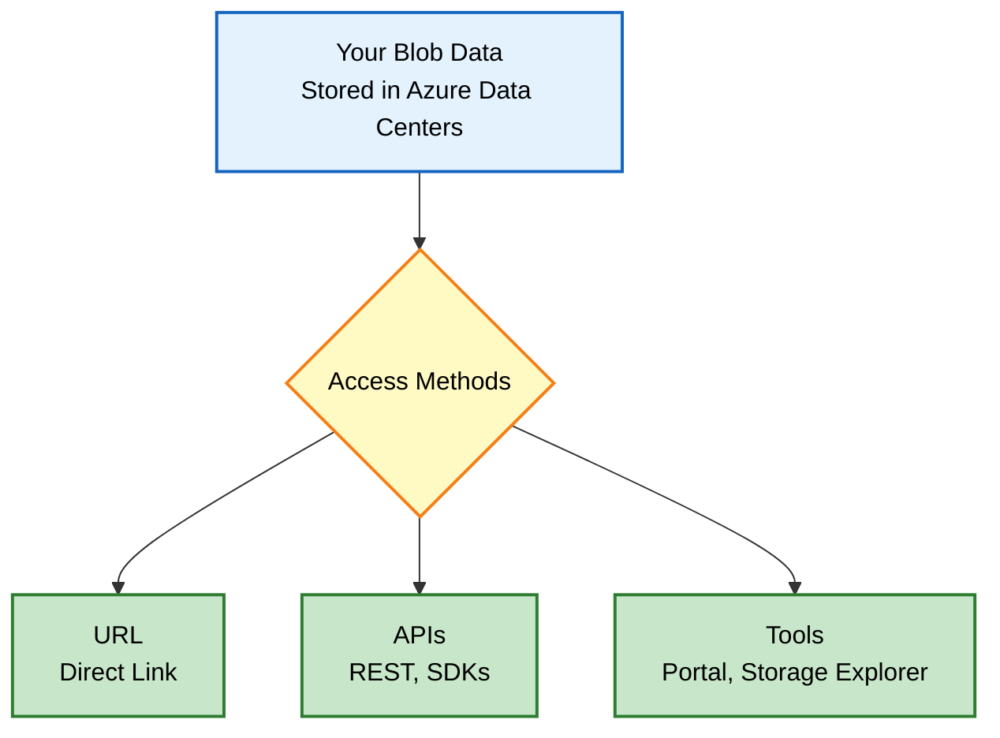
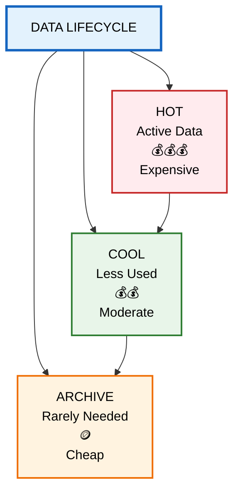
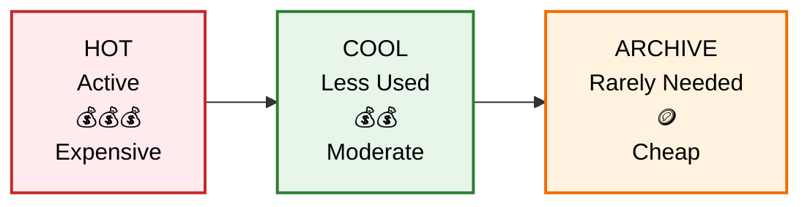
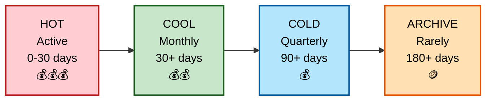
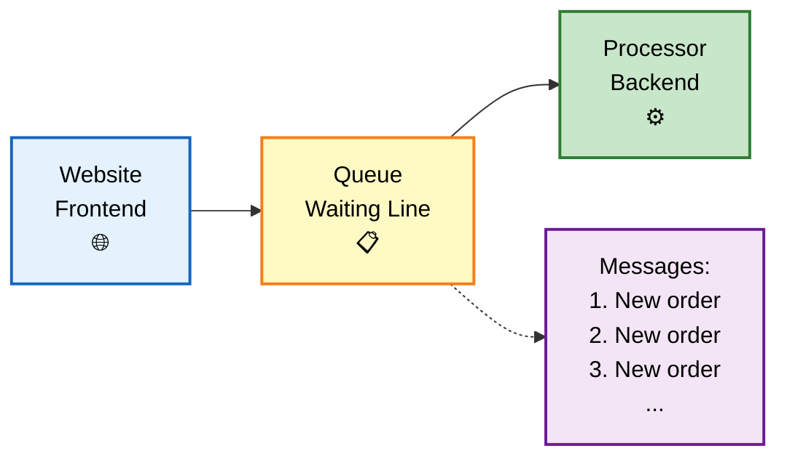
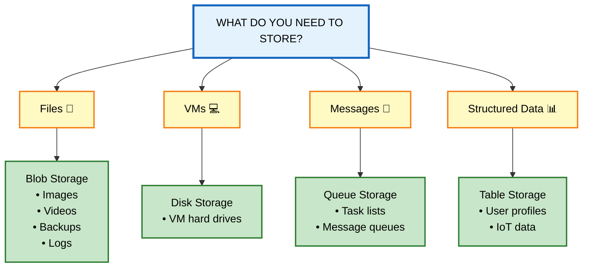

# Azure Storage Services - Simple Guide

## What is Azure Storage?

Think of **Azure Storage** as a massive digital warehouse in the cloud where you can store different types of data. Just like a real warehouse has different sections for different products (frozen food, electronics, documents), Azure Storage has different "services" for different types of data and use cases.

---

## The Five Main Storage Services

| Service | What It Is | Real-World Analogy | Best For |
|---------|-----------|-------------------|----------|
| **Azure Blobs** | Object storage for any file type | A giant digital filing cabinet | Photos, videos, backups, logs, big data |
| **Azure Files** | Managed cloud file shares | A shared network drive (like your office server) | Shared folders, replacing on-premise file servers |
| **Azure Queues** | Message storage system | A to-do list or task queue | Connecting different parts of apps, async processing |
| **Azure Disks** | Virtual hard drives | The C: drive on your computer | Azure virtual machines (VMs) |
| **Azure Tables** | NoSQL database | A simple spreadsheet that can handle millions of rows | Structured but non-relational data |

---

## Why Use Azure Storage? (The Benefits)

### 🛡️ 1. Durable & Highly Available
- **What it means:** Your data is safe even if things break
- **How it works:** Azure keeps multiple copies of your data automatically
- **Real example:** If a hard drive fails, your data is still safe on other drives
- **Bonus:** You can copy data to different cities/countries for disaster protection

### 🔒 2. Secure
- **Encryption:** All data is automatically scrambled (encrypted) when stored
- **Access control:** You decide exactly who can see what data
- **Think of it like:** A safety deposit box that only you have the key to

### 📈 3. Scalable
- **What it means:** Grows automatically as you need more space
- **Real example:** Start with 1GB, grow to 100 petabytes without changing anything
- **No worries about:** Running out of space or buying new hardware

### 🔧 4. Managed
- **What Azure handles:** Hardware maintenance, security updates, fixing broken parts
- **What you do:** Just use your data
- **Think of it like:** Renting a fully serviced apartment vs. owning a house

### 🌍 5. Accessible
- **Access from:** Anywhere with internet
- **Protocols:** HTTP/HTTPS (standard web)
- **Tools available:** 
  - Web portal (point and click)
  - Command line (PowerShell, Azure CLI)
  - Programming languages (.NET, Java, Python, Node.js, etc.)
  - REST API (for custom apps)
  - Azure Storage Explorer (desktop app)

---

## Deep Dive: Azure Blob Storage

### What is a "Blob"?
**BLOB = Binary Large Object** (fancy term for "any file")

A blob can be:
- 📸 Photos and images
- 🎬 Videos and movies
- 📄 Documents (PDFs, Word files)
- 📊 Database backups
- 📈 Log files
- 🔬 Scientific data
- 💬 Encrypted messages
- 🎮 Game assets

**Key advantage:** No restrictions on file types or sizes. Upload anything!

### Common Blob Storage Uses

| Use Case | Example |
|----------|---------|
| **Website images** | Product photos on an e-commerce site |
| **File sharing** | Distributing large files to users worldwide |
| **Streaming** | Netflix-style video delivery |
| **Backup & recovery** | Company database backups |
| **Archiving** | Old tax records you must keep but rarely access |
| **Data analysis** | Feeding data to AI/ML models |

## How to Access Blobs

**Access methods:**
- **Direct URL:** `https://myaccount.blob.core.windows.net/mycontainer/myfile.jpg`
- **REST API:** Standard web requests
- **SDKs:** Pre-built code libraries for .NET, Java, Python, Node.js, PHP, Ruby
- **Azure Portal:** Web interface (point and click)
- **Azure Storage Explorer:** Desktop application

---

## Blob Storage Tiers (Save Money Based on Usage)

Not all data is accessed equally. Azure lets you choose **storage tiers** to balance cost vs. access speed.

### The Four Tiers Explained

| Tier | Access Frequency | Min Storage | Cost | Access Speed | Use Case |
|------|-----------------|-------------|------|--------------|----------|
| **Hot** | Daily/multiple times per day | None | 💰💰💰 Highest | ⚡ Instant | Current website images, active databases |
| **Cool** | Monthly | 30 days | 💰💰 Medium | ⚡ Instant | Monthly reports, quarterly invoices |
| **Cold** | Quarterly | 90 days | 💰 Lower | ⚡ Instant | Old project files, compliance data |
| **Archive** | Rarely (yearly) | 180 days | 🪙 Lowest | 🐢 Hours (must "rehydrate") | Legal records, old backups |

### How Tiers Work

## Data Lifecycle: Moving Through Storage Tiers

As data gets older and less used, it moves to cheaper tiers:
Hot: Frequently accessed (highest cost, instant access)
Cool: Infrequently accessed (lower cost, instant access)
Archive: Rarely accessed (lowest cost, hours to retrieve)

**Alternative: Left-to-Right Flow Version**

## Data Lifecycle: Moving Through Storage Tiers

Data automatically moves from Hot → Cool → Archive as it ages, with costs decreasing at each step.

**Alternative: With Cold Tier Included**

## Data Lifecycle: Moving Through Storage Tiers

**Important Rules:**
- ✅ Hot, Cool, Cold can be set at the **account level** (applies to everything)
- ✅ **All tiers** can be set at the **individual blob level**
- ❌ Archive tier **cannot** be set at account level (only per blob)
- ⚠️ Cool/Cold have slightly lower availability guarantees (but same durability)
- ⚠️ Archive has **high retrieval costs** - only use for truly cold data

---

## Deep Dive: Azure Files

### What is Azure Files?
Managed file shares in the cloud that work exactly like your office file server, but without the hardware headaches.

### Supported Protocols

| Protocol | Works With | Best For |
|----------|-----------|----------|
| **SMB** (Server Message Block) | Windows, Linux, macOS | Windows environments, general file sharing |
| **NFS** (Network File System) | Linux, macOS | Linux environments, high-performance computing |

### Key Benefits Explained

| Benefit | What It Means | Real Example |
|---------|--------------|--------------|
| **Shared Access** | Multiple people can access same files | Marketing team editing the same brochure |
| **Fully Managed** | No server maintenance | No 3 AM calls about server crashes |
| **Scripting Support** | Automate with code | Automatically create shares for new projects |
| **Resiliency** | Always available | No downtime during power outages |
| **Familiar Code** | Use normal file commands | `copy`, `move`, `delete` work as expected |

### Azure File Sync
- **What it does:** Keeps a local copy of your cloud files on your Windows Server
- **Benefit:** Fast local access + cloud backup in one
- **Think of it like:** Dropbox or OneDrive, but for your entire server

---

## Deep Dive: Azure Queues

### What is a Queue?
A **message waiting line** for your applications.

### How It Works (Simple Example)

**The Flow:**
1. **Website (Frontend)** - Customer places an order
2. **Queue (Waiting Line)** - Order waits in line to be processed
3. **Processor (Backend)** - System picks up order and processes it

   **Key Point:** The queue acts as a buffer, ensuring the backend processor doesn't get overwhelmed during busy periods.

**Real Example - Online Pizza Order:**
1. 🍕 Customer places order on website
2. 📩 Order goes into Queue storage
3. 🔔 Azure Function triggers and processes order
4. 👨‍🍳 Kitchen receives order and starts cooking

### Queue Specifications
- **Capacity:** Virtually unlimited (millions of messages)
- **Message size:** Up to 64 KB per message
- **Access:** HTTP/HTTPS from anywhere
- **Common pairing:** Azure Functions (serverless computing)

---

## Deep Dive: Azure Disks

### What are Azure Disks?
Virtual hard drives for your Azure virtual machines (VMs).

### Comparison: Physical vs. Azure Disks

| Feature | Physical Disk | Azure Managed Disk |
|---------|--------------|-------------------|
| **Setup** | Buy, install, configure | Click button, done |
| **Maintenance** | You fix failures | Azure handles everything |
| **Availability** | Single point of failure | Automatically replicated |
| **Scaling** | Buy new hardware | Resize with restart |
| **Backup** | Manual process | Built-in snapshots |

**Think of it like:** Netflix for hard drives - stream storage capacity as needed without owning the hardware.

---

## Deep Dive: Azure Tables

### What is Table Storage?
A **NoSQL database** for storing structured data without complex relationships.

### What Makes It Different?

| Feature | Traditional SQL Database | Azure Tables |
|---------|------------------------|--------------|
| **Structure** | Rigid tables with relationships | Flexible, flat tables |
| **Scaling** | Vertical (bigger server) | Horizontal (more servers) |
| **Schema** | Fixed columns | Dynamic - each row can be different |
| **Best for** | Complex queries, transactions | Massive scale, simple data |

### Ideal Use Cases
- 🌐 Storing user profiles for millions of users
- 📊 IoT device telemetry data
- 📝 Log data from applications
- 🔍 Session state for web apps
- 📦 Metadata storage

**Key advantage:** Handles **massive amounts** of structured data cheaply and quickly.

---

## Quick Start: Which Azure Storage Service Do I Need?

---

## Summary Cheat Sheet

| If you need to... | Use this service |
|-------------------|-----------------|
| Store photos, videos, or any files | **Blob Storage** |
| Replace your office file server | **Azure Files** |
| Connect app components with messages | **Queue Storage** |
| Add storage to a virtual machine | **Disk Storage** |
| Store massive amounts of simple structured data | **Table Storage** |

---

## For better Understanding?

- [Azure Storage Documentation](https://docs.microsoft.com/azure/storage/)
- [Azure Pricing Calculator](https://azure.microsoft.com/pricing/calculator/)
- [Azure Storage Explorer Download](https://azure.microsoft.com/features/storage-explorer/)

The Azure Storage platform includes the following data services:

Azure Blobs: A massively scalable object store for text and binary data. Also includes support for big data analytics through Data Lake Storage Gen2.
Azure Files: Managed file shares for cloud or on-premises deployments.
Azure Queues: A messaging store for reliable messaging between application components.
Azure Disks: Block-level storage volumes for Azure VMs.
Azure Tables: NoSQL table option for structured, non-relational data.
Benefits of Azure Storage
Azure Storage services offer the following benefits for application developers and IT professionals:

Durable and highly available. Redundancy ensures that your data is safe if transient hardware failures occur. You can also opt to replicate data across data centers or geographical regions for additional protection from local catastrophes or natural disasters. Data replicated in this way remains highly available if an unexpected outage occurs.
Secure. All data written to an Azure storage account is encrypted by the service. Azure Storage provides you with fine-grained control over who has access to your data.
Scalable. Azure Storage is designed to be massively scalable to meet the data storage and performance needs of today's applications.
Managed. Azure handles hardware maintenance, updates, and critical issues for you.
Accessible. Data in Azure Storage is accessible from anywhere in the world over HTTP or HTTPS. Microsoft provides client libraries for Azure Storage in a variety of languages, including .NET, Java, Node.js, Python, PHP, Ruby, Go, and others, as well as a mature REST API. Azure Storage supports scripting in Azure PowerShell or Azure CLI. And the Azure portal and Azure Storage Explorer offer easy visual solutions for working with your data.
Azure Blobs
Azure Blob storage is an object storage solution for the cloud. It can store massive amounts of data, such as text or binary data. Azure Blob storage is unstructured, meaning that there are no restrictions on the kinds of data it can hold. Blob storage can manage thousands of simultaneous uploads, massive amounts of video data, constantly growing log files, and can be reached from anywhere with an internet connection.

Blobs aren't limited to common file formats. A blob could contain gigabytes of binary data streamed from a scientific instrument, an encrypted message for another application, or data in a custom format for an app you're developing. One advantage of blob storage over disk storage is that it doesn't require developers to think about or manage disks. Data is uploaded as blobs, and Azure takes care of the physical storage needs.

Blob storage is ideal for:

Serving images or documents directly to a browser.
Storing files for distributed access.
Streaming video and audio.
Storing data for backup and restore, disaster recovery, and archiving.
Storing data for analysis by an on-premises or Azure-hosted service.
Accessing blob storage
Objects in blob storage can be accessed from anywhere in the world via HTTP or HTTPS. Users or client applications can access blobs via URLs, the Azure Storage REST API, Azure PowerShell, Azure CLI, or an Azure Storage client library. The storage client libraries are available for multiple languages, including .NET, Java, Node.js, Python, PHP, and Ruby.

Blob storage tiers
Data stored in the cloud can grow at an exponential pace. To manage costs for your expanding storage needs, it's helpful to organize your data based on attributes like frequency of access and planned retention period. Data stored in the cloud can be handled differently based on how it's generated, processed, and accessed over its lifetime. Some data is actively accessed and modified throughout its lifetime. Some data is accessed frequently early in its lifetime, with access dropping drastically as the data ages. Some data remains idle in the cloud and is rarely, if ever, accessed after it's stored. To accommodate these different access needs, Azure provides several access tiers, which you can use to balance your storage costs with your access needs.

Azure Storage offers different access tiers for your blob storage, helping you store object data in the most cost-effective manner. The available access tiers include:

Hot access tier: Optimized for storing data that is accessed frequently (for example, images for your website).
Cool access tier: Optimized for data that is infrequently accessed and stored for at least 30 days (for example, invoices for your customers).
Cold access tier: Optimized for storing data that is infrequently accessed and stored for at least 90 days.
Archive access tier: Appropriate for data that is rarely accessed and stored for at least 180 days, with flexible latency requirements (for example, long-term backups).
The following considerations apply to the different access tiers:

Hot, cool, and cold access tiers can be set at the account level. The archive access tier isn't available at the account level.
Hot, cool, cold, and archive tiers can be set at the blob level, during or after upload.
Data in the cool and cold access tiers can tolerate slightly lower availability, but still requires high durability, retrieval latency, and throughput characteristics similar to hot data. For cool and cold data, a lower availability service-level agreement (SLA) and higher access costs compared to hot data are acceptable trade-offs for lower storage costs.
Archive storage stores data offline and offers the lowest storage costs, but also the highest costs to rehydrate and access data.
Azure Files
Azure File storage offers fully managed file shares in the cloud that are accessible via the industry standard Server Message Block (SMB) or Network File System (NFS) protocols. Azure Files file shares can be mounted concurrently by cloud or on-premises deployments. SMB Azure file shares are accessible from Windows, Linux, and macOS clients. NFS Azure Files shares are accessible from Linux or macOS clients. Additionally, SMB Azure file shares can be cached on Windows Servers with Azure File Sync for fast access near where the data is being used.

Azure Files key benefits:
Shared access: Azure file shares support the industry standard SMB and NFS protocols, meaning you can seamlessly replace your on-premises file shares with Azure file shares without worrying about application compatibility.
Fully managed: Azure file shares can be created without the need to manage hardware or an OS. This means you don't have to deal with patching the server OS with critical security upgrades or replacing faulty hard disks.
Scripting and tooling: PowerShell cmdlets and Azure CLI can be used to create, mount, and manage Azure file shares as part of the administration of Azure applications. You can create and manage Azure file shares using Azure portal and Azure Storage Explorer.
Resiliency: Azure Files has been built from the ground up to always be available. Replacing on-premises file shares with Azure Files means you don't have to wake up in the middle of the night to deal with local power outages or network issues.
Familiar programmability: Applications running in Azure can access data in the share via file system I/O APIs. Developers can therefore use their existing code and skills to migrate existing applications. In addition to System IO APIs, you can use Azure Storage Client Libraries or the Azure Storage REST API.
Azure Queues
Azure Queue storage is a service for storing large numbers of messages. Once stored, you can access the messages from anywhere in the world via authenticated calls using HTTP or HTTPS. A queue can contain as many messages as your storage account has room for (potentially millions). Each individual message can be up to 64 KB in size. Queues are commonly used to create a backlog of work to process asynchronously.

Queue storage can be combined with compute functions like Azure Functions to take an action when a message is received. For example, you want to perform an action after a customer uploads a form to your website. You could have the submit button on the website trigger a message to the Queue storage. Then, you could use Azure Functions to trigger an action once the message was received.

Azure Disks
Azure Disk storage, or Azure managed disks, are block-level storage volumes managed by Azure for use with Azure VMs. Conceptually, they’re the same as a physical disk, but they’re virtualized – offering greater resiliency and availability than a physical disk. With managed disks, all you have to do is provision the disk, and Azure will take care of the rest.

Azure Tables
Azure Table storage stores large amounts of structured data. Azure tables are a NoSQL datastore that accepts authenticated calls from inside and outside the Azure cloud. This enables you to use Azure tables to build your hybrid or multicloud solution and have your data always available. Azure tables are ideal for storing structured, non-relational data.
